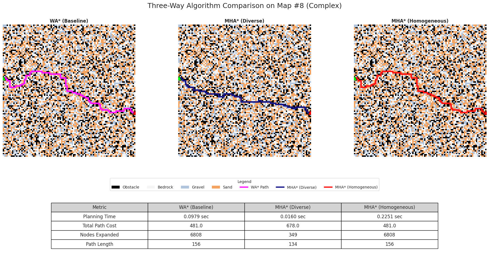
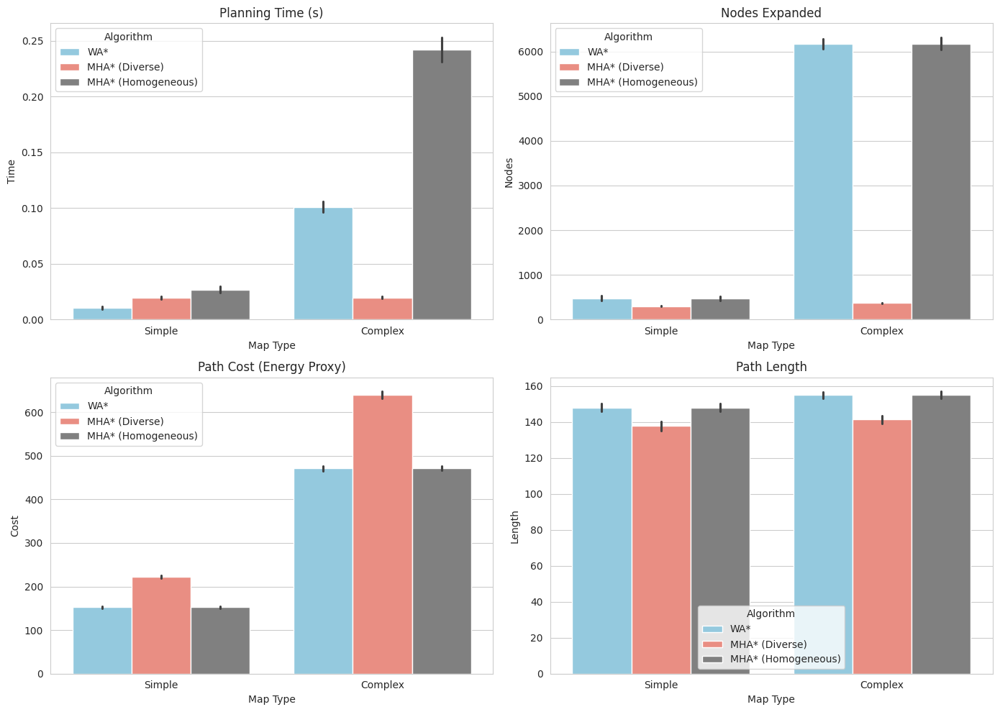

# Multi-Heuristic A* for Mars Rover Navigation 🚀

An ablation study evaluating the role of heuristic diversity in Multi-Heuristic A* (MHA*) within cost-aware, synthetic Mars-like terrain maps.

## Overview 🛠️
This project deconstructs the MHA* algorithm to determine if its performance gains stem from its multi-queue architecture or the diversity of its heuristics. 

### Key Features
- **Planners Implemented:** Weighted A* (WA*), MHA* with Diverse Heuristics, and MHA* with Homogeneous Heuristics.
- **Heuristics Used:** Euclidean (Anchor), Scaled Manhattan, and Aggressive Euclidean.
- **Custom Terrain Model:** Synthetic 100x100 grid maps with varying traversal costs for Bedrock (1), Gravel (5), and Sand (10).

---

## Path Planning Visualization 📍

*Figure 1: Comparison of paths generated by different planners across Mars-like terrain.*

---

## Results & Performance 📊
Experiments across 500 scenarios show that MHA* with diverse heuristics achieves orders-of-magnitude reductions in node expansions and planning time compared to WA* in complex terrains.

*Figure 2: Performance metrics highlighting the efficiency of diverse heuristics.*

## Requirements 📦
- Python 3.x
- NumPy
- Matplotlib
- Seaborn
- SciPy

## Usage 💻
Run the `mars_navigation_planner.ipynb` notebook to:
1. Generate the terrain data.
2. Execute the path-planning experiments.
3. Visualize the performance metrics.
